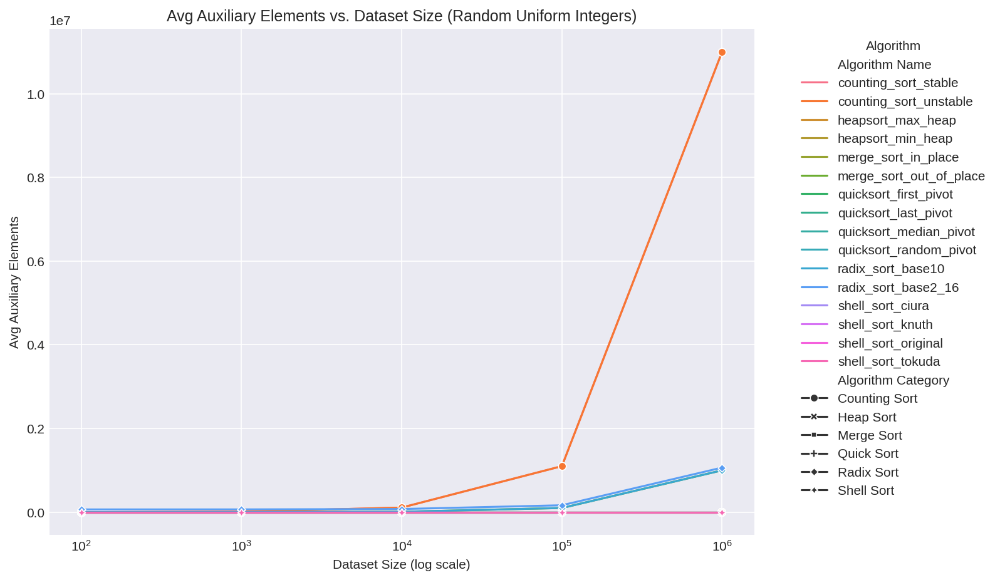
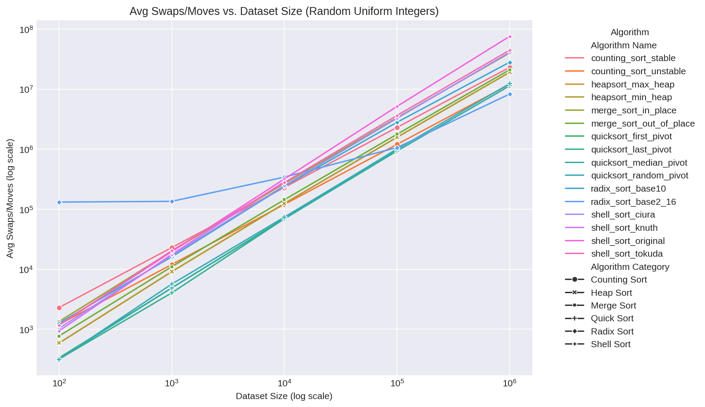

# Algoritmi de Sortare

## Algoritmi Testați

- **Counting Sort** (Stable and Unstable)
- **Radix Sort** (Base 10 and Base 2^16)
- **Heap Sort** (Max Heap and Min Heap)
- **Merge Sort** (In-Place and With Extra Memory)
- **Shell Sort** (Original, Knuth, Ciura, Tokuda)
- **Quick Sort** (First Pivot, Last Pivot, Median, Random Pivot)
- **Funcția Built-in `sorted()` din Python** (Timsort)

---

## 1. Counting Sort

**Puncte Forte:**
- Timp liniar pentru numere întregi cu interval mic sau puține valori unice.
- Nu face comparații între elemente.
- Varianta stabilă păstrează ordinea elementelor egale.

**Puncte Slabe:**
- Folosește multă memorie suplimentară: Necesită spațiu O(k+n), unde k este intervalul de valori.
- Nu este pentru uz general: Funcționează doar pentru numere întregi sau date care pot fi mapate la un interval mic.

**Rezultate Specifice:**
- Pentru `numere_întregi_aleatorii_uniforme` cu 1.000.000 elemente:
  - **Stabilă**: Timp = 1,47s, Comparații = 0, Mutări = 22.999.981, Elemente Auxiliare = 10.999.991
  - **Instabilă**: Timp = 1,02s, Comparații = 0, Mutări = 11.999.991, Elemente Auxiliare = 10.999.991
- Pentru `numere_întregi_cu_puține_valori_unice` cu 1.000.000 elemente:
  - **Stabilă**: Timp = 1,33s, Mutări = 22.999.713, Elemente Auxiliare = 10.999.857

**Grafice:**
_(s)_vs_size_random_int.png)

---

## 2. Radix Sort

**Puncte Forte:**
- Timp liniar pentru numere întregi/șiruri de lungime fixă.
- Nu face comparații.
- Poate sorta și numere negative (cu decalaj).

**Puncte Slabe:**
- Memorie auxiliară: Necesită O(n + bază) pe parcurs.
- Nu sortează pe loc.
- Performanța depinde de bază și distribuția datelor.

**Rezultate Specifice:**
- Pentru `numere_întregi_aleatorii_uniforme` cu 1.000.000 elemente:
  - **Baza 10**: Timp = 3,30s, Mutări = 28.000.133, Elemente Auxiliare = 1.000.010
  - **Baza 2^16**: Timp = 0,88s, Mutări = 8.262.142, Elemente Auxiliare = 1.065.536

**Grafice:**
_(s)_vs_size_random_int.png)

---

## 3. Heap Sort

**Puncte Forte:**
- Timp O(n log n) întotdeauna.
- Sortează pe loc.
- Nu se degradează în cazul cel mai defavorabil.

**Puncte Slabe:**
- Nu este stabilă.
- Face mai multe schimbări decât Merge Sort/Quick Sort.
- Este mai lent în practică decât Quick Sort pentru date aleatorii.

**Rezultate Specifice:**
- Pentru `numere_întregi_aleatorii_uniforme` cu 1.000.000 elemente:
  - **Grămadă Maximă**: Timp = 5,28s, Comparații = 36.792.867, Mutări = 19.048.905
  - **Grămadă Minimă**: Timp = 4,85s, Comparații = 36.794.459, Mutări = 19.048.712

**Grafice:**
_(s)_vs_size_random_int.png)

---

## 4. Merge Sort

**Puncte Forte:**
- Timp O(n log n) întotdeauna.
- Stabilă.
- Performanță predictibilă.

**Puncte Slabe:**
- Memorie auxiliară: Varianta cu memorie suplimentară necesită spațiu extra O(n).
- Varianta pe loc: Mai complexă, mai multe mutări.

**Rezultate Specifice:**
- Pentru `numere_întregi_aleatorii_uniforme` cu 1.000.000 elemente:
  - **Pe Loc**: Timp = 2,57s, Comparații = 18.673.740, Mutări = 39.902.848, Elemente Auxiliare = 0
  - **Cu Memorie Suplimentară**: Timp = 2,42s, Comparații = 18.674.732, Mutări = 20.951.424, Elemente Auxiliare = 1.000.000

**Grafice:**
_(s)_vs_size_random_int.png)

---

## 5. Shell Sort

**Puncte Forte:**
- Sortează pe loc.
- Simplă.
- Secvența de intervale afectează performanța.

**Puncte Slabe:**
- Nu este stabilă.
- Timp O(n^2) în cazul cel mai defavorabil pentru unele secvențe.
- Performanța variază în funcție de date și secvența de intervale.

**Rezultate Specifice:**
- Pentru `numere_întregi_aleatorii_uniforme` cu 1.000.000 elemente:
  - **Ciura**: Timp = 4,76s, Comparații = 32.035.236, Mutări = 40.939.266
  - **Tokuda**: Timp = 5,06s, Comparații = 35.911.616, Mutări = 44.402.709
  - **Original**: Timp = 8,11s, Comparații = 65.609.989, Mutări = 75.530.251

**Grafice:**
_(s)_vs_size_random_int.png)
_(s)_shell_sort_ciura_size_10000_datasets.png)

---

## 6. Quick Sort

**Puncte Forte:**
- Timp mediu O(n log n).
- Sortează pe loc.
- Folosește puțină memorie auxiliară.

**Puncte Slabe:**
- Timp O(n^2) în cazul cel mai defavorabil (pivot first/last, sorted/reverse sorted data).
- Nu este stabilă.
- Sensibil la alegerea pivotului.

**Rezultate Specifice:**
- Pentru `numere_întregi_aleatorii_uniforme` cu 1.000.000 elemente:
  - **First Pivot**: Timp = 1,74s, Comparații = 24.028.883, Mutări = 1.007.505
  - **Last Pivot**: Timp = 2,08s, Comparații = 23.053.146, Mutări = 11.309.689
  - **Pivot Aleator**: Timp = 2,38s, Comparații = 24.878.994, Mutări = 12.322.918
- Pentru `numere_întregi_sortate_invers` cu 1.000.000 elemente:
  - **First Pivot**: Timp = 175,47s, Comparații = 4.752.928.963, Mutări = 195.260 (performanță catastrofală)

**Grafice:**
_(s)_vs_size_random_int.png)
_(s)_vs_size_reverse_sorted_int.png)
_(s)_quicksort_random_pivot_size_10000_datasets.png)

---

## 7. Funcția Built-in `sorted()` din Python (Timsort)

**Grafice:**
_(s)_vs_size_random_int.png)

---

## 8. Recomandări

- Pentru uz general: Funcția `sorted()` din Python (Timsort) este cea mai sigură și rapidă.
- Pentru chei întregi, interval mic: Counting Sort sau Radix Sort.
- Pentru date mari, generale: Merge Sort (dacă este necesară stabilitatea), Quick Sort (pivot median/aleator) în caz contrar.
- Pentru medii cu memorie limitată: Heap Sort sau Quick Sort/Shell Sort pe loc.
- De evitat: Quick Sort cu primul/ultimul pivot pe date aproape sortate, Counting Sort pe date cu interval mare.